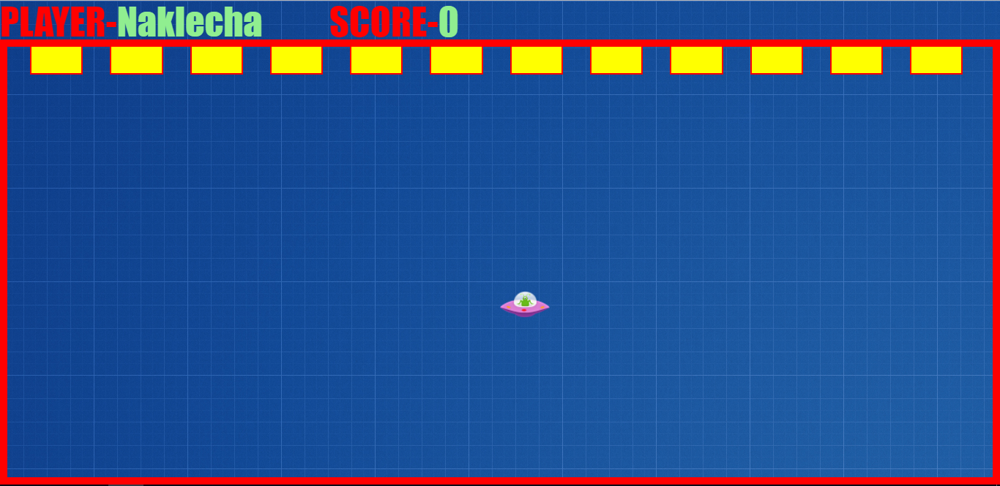
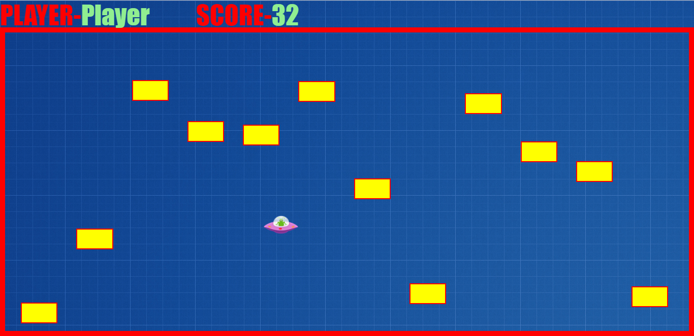
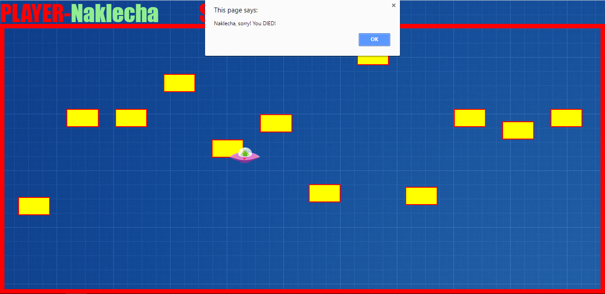

# html-game-doodleship
A simple endless "Doodle Ship" game made using "ONLY" HTML, CSS and JavaScript. No complications, just download, learn and play!

### About
In this game you have to control a spaceship, while dodging blocks falling. Your score is increased when a block reaches the bottom.

### ScreenShots

</img>
</img>
</img>

### Features
This game is 100% responsive to any screen size, so dont worry about the screen size of your device. Also, the code is extremely simple to understand, learn and edit.

### How To Use
Dowload all the files and run the HTML on a browser. That's it! You are good to go!

### Bug(s)
As the spaceship image is a square the hitboxes are not perfect.

### Show us what you’ve got!
Improve our hitboxes and improve the aesthetics still maintaining the comical effect. Happy Coding!

